# H1 Humanoid Robot Simulator



> **Status: WORK IN PROGRESS** — the simulation is running; natural-language control, telemetry and more are being built.

A full-stack simulation project for the **Unitree H1-2 humanoid robot** — currently the
simulation of the robot you see walking above runs headlessly on a 2 GB-RAM cloud VPS,
streams live to a web dashboard, and is being wired up to be controlled by **natural
language**.

## What's inside

| Layer | Stack |
|---|---|
| Robot model | Unitree H1-2 (via [`ros2_heinz`](https://github.com/K-d4wg/ros2_heinz), Jazzy + Harmonic) |
| Simulator | Gazebo Sim (Harmonic), headless server mode, Bullet Featherstone physics |
| Robotics framework | ROS 2 Jazzy |
| Visualization | [Foxglove](https://foxglove.dev) (WebSocket bridge, live 3D view of the robot) |
| Brain (in progress) | Google Gemini — natural language → robot actions |
| Telemetry (in progress) | AWS free tier (Lambda + DynamoDB + SNS + CloudWatch) |

## Current progress

- [x] ROS 2 Jazzy + Gazebo Harmonic + Foxglove bridge installed and verified
- [x] H1-2 simulation running headless on a 2 GB-RAM VPS (21 actuated joints)
- [x] Live visualization in Foxglove web (`/tf`, `/joint_states`, `/h1/odometry`, `/imu`)
- [x] Auto-restartable headless launch + smoke-test gate
- [x] Standing / walking controllers (LocoMuJoCo motion replay)
- [x] Gemini natural-language agent (safety-validated tool loop)
- [x] AWS telemetry + anomaly alerts (S3 + DynamoDB + SNS)
- [ ] Voice interface (Gemini → speech synthesis)

## Quick start

```bash
# needs ROS 2 Jazzy + Gazebo Harmonic (vendor) + foxglove-bridge
cd humanoid_sim_ws
colcon build --packages-select h1_bringup
scripts/launch_h1.sh            # headless sim + bridge + foxglove (port 8765)
scripts/smoke.sh                # gate: asserts key topics are publishing
```

Connect Foxglove web to `ws://<host>:8765`, add `/tf` and `/tf_static` to the 3D panel
transforms, set the fixed frame to `h1_ign`, and the robot comes alive.

## Architecture

```
┌────────────┐  ┌───────────────┐  ┌──────────────┐  ┌───────────────┐
│   Gemini   │→ │ h1_llm_agent  │→ │  h1_control  │→ │  Gazebo Sim   │
│  (natural  │  │ tool loop +   │  │ stand/walk/  │  │  (headless)   │
│  language) │  │ safety layer  │  │ stop actions │  │  H1-2 physics │
└────────────┘  └───────────────┘  └──────────────┘  └──────┬────────┘
                                                            │ /joint_states
                                     ┌──────────────┐        │ /h1/odometry
                                     │ Foxglove web │◄───────┘ /imu
                                     │  live 3D     │
                                     └──────────────┘
```

Design details and progress tracking live in the repo: `plan.md` (roadmap),
`progress.md` (task tracker with evidence), `docs/contracts/topics.md` (message contracts).

## Roadmap

- **M1** ✅ Simulator running + Foxglove live view
- **M2** ✅ Controllers: stand, walk (LocoMuJoCo replay), stop
- **M3** ✅ Gemini agent: "stand up", "walk forward", "stop" in natural language
- **M4** ✅ AWS telemetry + anomaly detection + email alerts (S3/DynamoDB/SNS)
- **M5** ✅ Vision pick-place (ArUco → grasp via MoveIt2)
- **M6** ✅ SLAM (slam_toolbox) + Nav2 (DWB + NavFn)
- **M8** ✅ RL stand policy (MuJoCo proxy → ONNX export/quantize)
- **M7+** Voice and hardware bring-up in progress

## License

Apache-2.0 (project code). Vendor simulation code: see `src/ros2_heinz`.